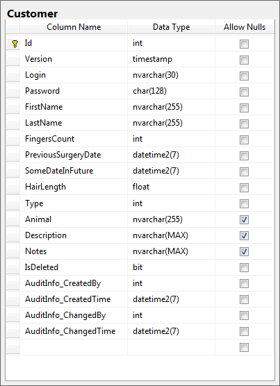
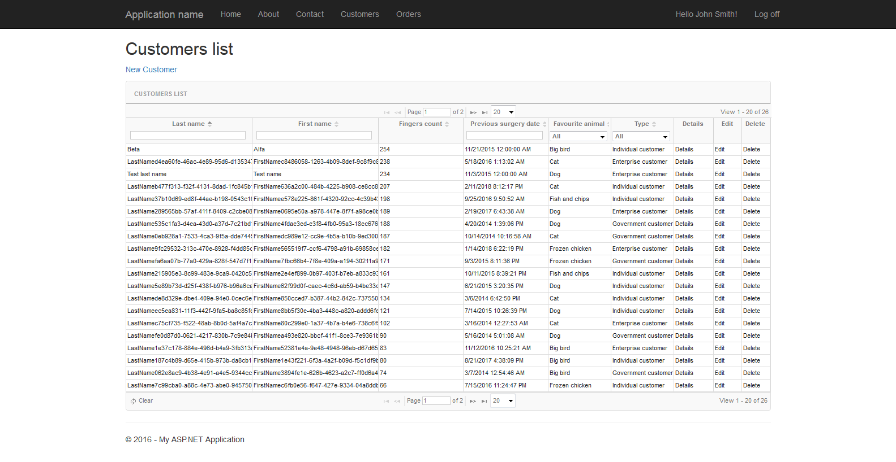
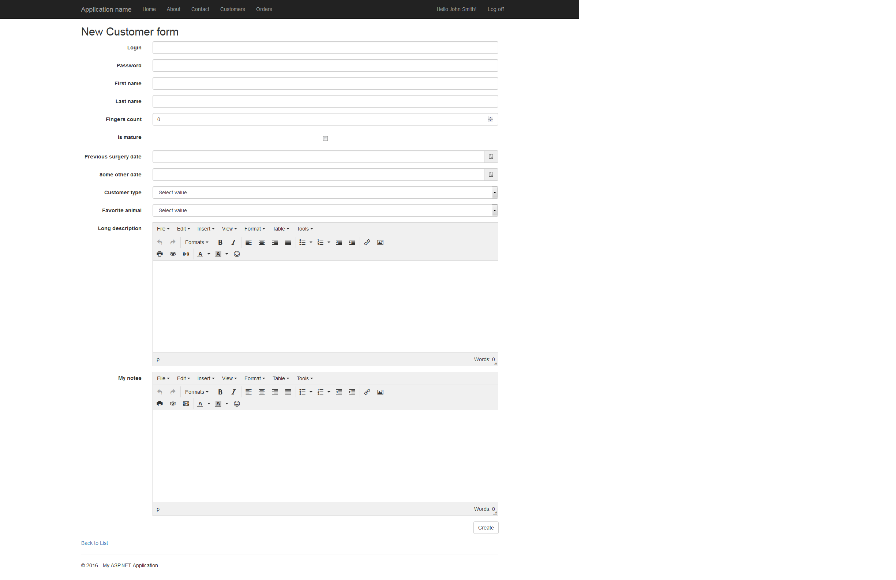
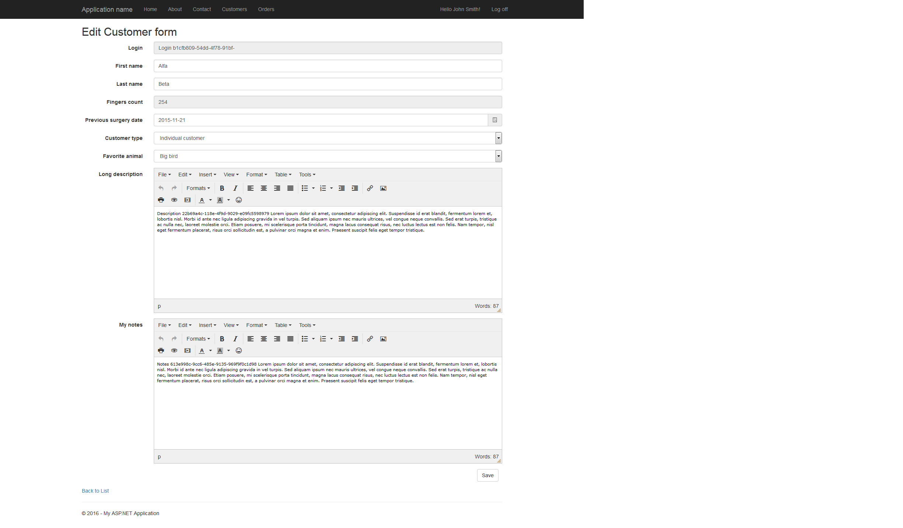
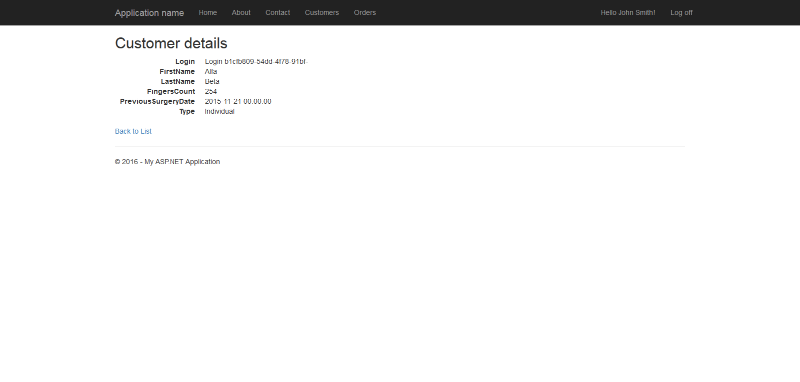
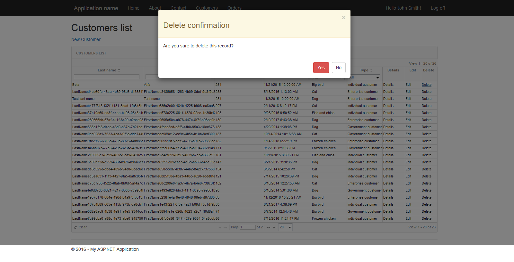

# PizzaMVC
Fast and simple CRUD framework based on ASP.NET MVC

## Summary

PizzaMVC was created for making development of CRUD applications very fast. As developer you have to define only few types to add new functionality 
to your application. (By 'functionality' I mean database entity with CRUD operations and GUI screens such as list, details, create and edit view.) 
You don't have to write HTML, JS and SQL code or create many layers of C# applications. Everything from GUI to database will be handled by PizzaMVC - of course if you agree to follow few simple conventions.

PizzaMVC is designed with MVC pattern in mind. The real MVC, not the "MVC from Microsoft's tutorials". It means that types describing database tables 
are not sent to user interface and vice versa. It means thin controllers which handle user input, with no business or data access logic inside. 
(It also means no useless wrappers for ORM called "repositories", so popular in Entity Framework world.)

Pizza MVC solves simply problems in simple way but doesn't forbid you from doing anything more sophisticated. All default operations can be overriden, 
services can do much more than only CRUD operations, and of course you can call your custom logic from any part of application. 
You also can combine Pizza with DDD if you want to.

## How to use it

First you have to define persistence model which describes what will be stored in database:

```C#
public class Customer : SoftDeletableModelBase
{
    [Unique, UnicodeString(30)]
    public virtual string Login { get; set; }

    [FixedLengthAnsiString(128)]
    public virtual string Password { get; set; }

    public virtual string FirstName { get; set; }
    public virtual string LastName { get; set; }
    public virtual int FingersCount { get; set; }
    public virtual DateTime PreviousSurgeryDate { get; set; }
    public virtual DateTime SomeDateInFuture { get; set; }
    public virtual double HairLength { get; set; }
    public virtual CustomerType Type { get; set; }

    [AllowNull]
    public virtual AnimalSpecies? Animal { get; set; }

    [AllowNull, UnicodeString]
    public virtual string Description { get; set; }

    [AllowNull, UnicodeString]
    public virtual string Notes { get; set; }

    public virtual string FullName
    {
        get { return string.Format("{0} {1}", this.FirstName, this.LastName); }
    }
}
```

Then you have to define models for views: grid, create, edit and details. These types defines what users will see in web browser. Obviously, models for create and edit operations will probably have some validation attributes.
**Very important thing** - you have to keep same names and types for properties in persistence model and view model if you want them to be automatically maped. You also shouldn't use reserved names like 'Id', 'Version'. But nested properties are handled, so if you have `Order` type with property of type `Customer` with has `string Name` property, you can define it in viewmodel as `string CustomerName` and this property will be handled by framework.

```C#
public sealed class CustomerGridModel : GridModelBase
{
    [Display(Name = "Login")]
    public string Login { get; set; }

    [Display(Name = "First name")]
    public string FirstName { get; set; }
        
    [Display(Name = "Last name")]
    public string LastName { get; set; }

    [Display(Name = "Previous surgery date")]
    public DateTime PreviousSurgeryDate { get; set; }

    [Display(Name = "Fingers count")]
    public int FingersCount { get; set; }
}

public sealed class CustomerEditModel : EditModelBase
{
    [Display(Name = "Login")]
    [Editable(false)]
    public string Login { get; set; }

    [Display(Name = "First name")]
    public string FirstName { get; set; }

    [Display(Name = "Last name"), Required(ErrorMessage = Resources.RequiredMessage)]
    public string LastName { get; set; }

    [Display(Name = "Fingers count"), Required(ErrorMessage = Resources.RequiredMessage)]
    [Editable(false)]
    public int FingersCount { get; set; }

    [Display(Name = "Previous surgery date"), Required(ErrorMessage = Resources.RequiredMessage)]
    public DateTime PreviousSurgeryDate { get; set; }

    [Display(Name = "Customer type"), Required(ErrorMessage = Resources.RequiredMessage)]
    public CustomerType Type { get; set; }

    [Display(Name = "Favorite animal")]
    public AnimalSpecies? Animal { get; set; }

    [Display(Name = "Long description")]
    [AllowHtml, DataType(DataType.Html)]
    public string Description { get; set; }

    [Display(Name = "My notes")]
    [AllowHtml, DataType(DataType.Html)]
    public string Notes { get; set; }
}
```

Next you have define service wich will associate view models with persistence model:

```C#
public interface ICustomersService 
    : IGridServiceBase<CustomerGridModel, CustomerDetailsModel, CustomerEditModel, CustomerCreateModel>
{
}
```

And implementation of this service:

```C#
public class CustomersGridService 
    : GridServiceBase<Customer, CustomerGridModel, CustomerDetailsModel, CustomerEditModel, CustomerCreateModel>, ICustomersService
{
    public CustomersGridService(ISession session) : base(session)
    {
    }
}
```

Then you need an ASP.NET MVC controller. This is most complicated part because you have to define how grid will look like, define default sort and other column attributes. You can also disable new/edit/delete/details links.

```C#
public class CustomersController
    : GridControllerBase<ICustomersService, CustomerGridModel, CustomerDetailsModel, CustomerEditModel, CustomerCreateModel>
{
    public CustomersController(ICustomersService service) : base(service)
    {
    }

    protected override Dictionary<ViewType, string> ViewNames
    {
        get
        {
            return new Dictionary<ViewType, string> {
                { ViewType.Index, "Customers list" },
                { ViewType.Create, "New Customer form" },
                { ViewType.Edit, "Edit Customer form" },
                { ViewType.Details, "Customer details" },
            };
        }
    }

    protected override GridMetamodel<CustomerGridModel> GetGridMetamodel()
    {
        var gridMetaModel = new GridMetamodelBuilder<CustomerGridModel>()
            .SetCaption("Customers list")
            .AllowNew("New Customer").AllowEdit().AllowDelete().AllowDetails()
            .AddColumn(x => x.LastName, 200)
            .AddColumn(x => x.FirstName, 200)
            .AddDefaultSortColumn(x => x.FingersCount, SortMode.Descending, 150, ColumnWidthMode.Fixed, FilterOperator.Disabled)
            .AddColumn(x => x.PreviousSurgeryDate, 150, ColumnWidthMode.Fixed, FilterOperator.DateEquals)
            .Build();

        return gridMetaModel;
    }
}
```

That's all! You don't have to call ORM, write any HTML views, similar actions in all controllers. 
You don't even have to pass and map identical objects through seven layers of application just because some guy called "architect" said that this is good design.

## Effect

In result you will get database table like that:



Index page with grid:



Create form:



Edit form:



Details form:



And also confirmation dialog during delete:




## Features

### Frontend

1. Grid allowing to paging, filtering and sorting data.
2. Forms for create and edit operations with validation.
3. Specific UI controls for certain data types, for example: TinyMCE for long text content.
4. Global error handling for all AJAX operations.
5. Rendering dropdowns for enums properties.

### Backend

1. Efficient loading data for grid. Only values wich are needed to display in grid will be retrived from database. 
PizzaMVC does projections instead of reading whole rows.
2. Simple audit (creation date, creation user, last edit date, last edit user).
3. Soft delete (for every model marked as soft deletable on ORM level).
4. Transactions (there is only one place where commit is called).
5. Framework uses interfaces for all models but also provides set of default implementations for all purposes.
6. Easy generation of sample data. This mechanism uses AutoFixture and respects attributes from Pizza.

## How to run

For now there is no Nuget package, so you have to:

1. Download code from GitHub. (You need Visual Studio 2013 or 2015 to open solution.)
2. Create two databases: "Pizza_Tests" (for integration tests) and "Kebab" on you SQL Server instance. 
3. If you don't use default instance name, you also should tune connection strings in projects: 
   Pizza.Framework.IntegrationTests, KebabManager.Web and KebabManager.SchemaBuilder.
4. Run KebabManager.SchemaBuilder console application.
5. Now you can run KebabManager.Web application. 

It is standard ASP.NET MVC 5 template with additional tab named "Customers" wich shows features of PizzaMVC.

## Framework and libraries

### Frontend

- Bootstrap
- JqGrid
- TinyMCE

### Backend

- NHibernate
- Fluent NHibernate
- AutoFixture
- Autofac
- ValueInjecter

### Unit tests

- NUnit
- NUnit.Should
- NUnit.Asserts.Compare
- NSubsitute
- AutoFixture
